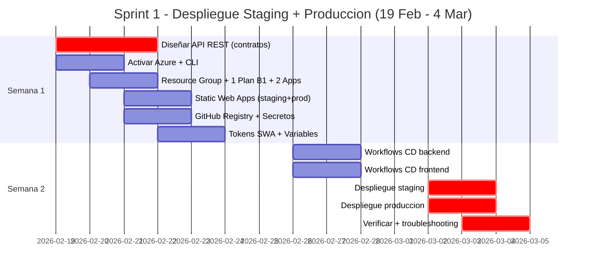
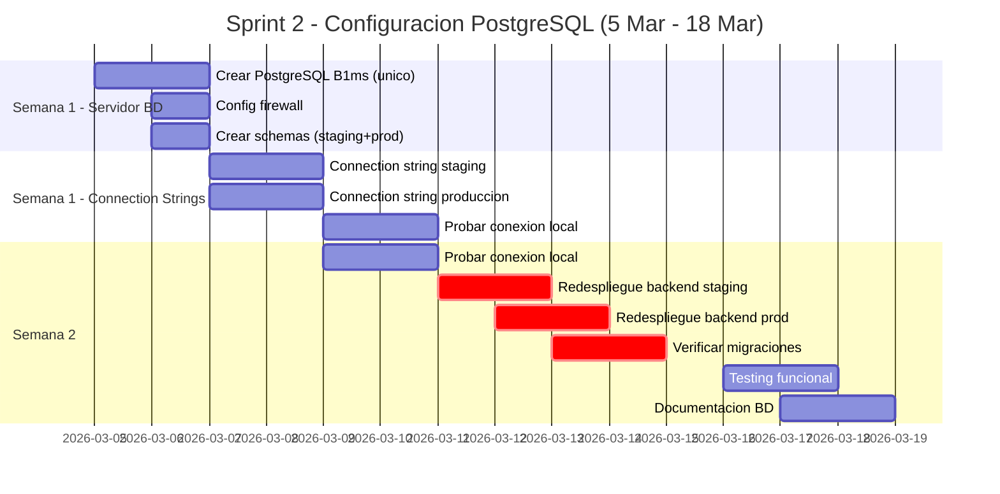
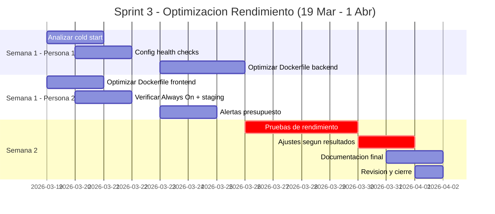
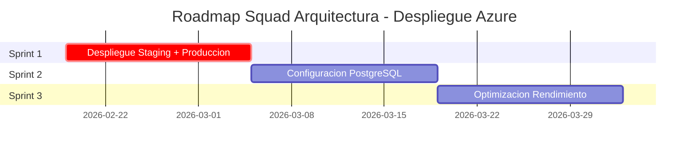

# Planning Squad Arquitectura - Despliegue Azure

## MeerKatters - Plataforma de Comunidades de Estudio

### Grupo 9 – Turno de tarde

---

**Proyecto:** MeerKatters  
**Documento:** Planificación de Sprints / Arquitectura  
**Sprint:** Sprint DP  
**Semana:** Semana 3  
**Estado:** Aprobado  
**Fecha:** 16/02/2026  
**Autor(es):** Raimundo Jiménez Lara, Manuel María Calderón Rodríguez

---

## Resumen del Objetivo

Desplegar la aplicación MeerKatters en Azure App Service como PaaS, incluyendo:

| Componente | Tecnología | Servicio Azure |
|------------|------------|----------------|
| Backend (prod) | Spring Boot 3.3.5 + Java 21 | Azure App Service B1 (Always On) |
| Backend (staging) | Spring Boot 3.3.5 + Java 21 | Azure App Service B1 (mismo plan, Always On) |
| Frontend | React 18 | Azure Static Web Apps (Free) |
| Base de datos | PostgreSQL | Azure Database for PostgreSQL |
| Imágenes Docker | Docker | GitHub Container Registry (ghcr.io) |
| CD | GitHub Actions | Integrado con Azure |

> **Nota:** Los pipelines de CI ya están implementados. Este planning se centra en infraestructura y CD.

---

## Capacidad del Equipo

| Métrica | Valor |
|---------|-------|
| Personas | 2 |
| Horas/semana por persona | 6 |
| Duración sprint | 2 semanas |
| **Horas totales/sprint** | **24 horas** (12h × 2 personas) |

---

## Calendario de Sprints

| Sprint | Inicio | Fin | Duración |
|--------|--------|-----|----------|
| Sprint 1 | 19/02/2026 | 04/03/2026 | 2 semanas |
| Sprint 2 | 05/03/2026 | 18/03/2026 | 2 semanas |
| Sprint 3 | 19/03/2026 | 01/04/2026 | 2 semanas |

---

# Sprint 1: Despliegue Completo Staging + Producción

**Objetivo:** Desplegar backend y frontend funcionando en Azure App Service en AMBOS entornos (staging y producción). Sin base de datos por ahora.

**Fechas:** 19/02/2026 - 04/03/2026 (2 semanas)  
**Capacidad:** 24 horas disponibles (12h por persona)

## Tareas Detalladas Sprint 1

| ID | Tarea | Responsable | Horas | Semana |
|----|-------|-------------|-------|--------|
| 1.0 | **Diseñar la API REST** (endpoints, DTOs, contratos) para que front y back puedan trabajar en paralelo | Ambos | 3 | S1 |
| 1.1 | Activar Azure for Students y verificar créditos $100 | Persona 1 | 1 | S1 |
| 1.2 | Instalar y configurar Azure CLI | Ambos | 1 | S1 |
| 1.3 | Crear Resource Group único (`rg-meerkatters`) | Persona 1 | 1 | S1 |
| 1.4 | Crear 1 Plan B1 + 2 Web Apps (Producción y Staging) con Always On | Persona 1 | 2 | S1 |
| 1.5 | Crear Static Web Apps (staging + prod, GRATIS) | Persona 2 | 2 | S1 |
| 1.6 | Configurar GitHub Container Registry | Persona 1 | 1 | S1 |
| 1.7 | Crear Service Principal único + secreto `AZURE_CREDENTIALS` | Persona 1 | 1 | S1 |
| 1.8 | Obtener tokens Static Web Apps + configurar variables GitHub (incluir `AZURE_BACKEND_APP_STAGING`) | Persona 2 | 2 | S1 |
| 1.9 | Revisar/ajustar workflows CD backend | Persona 2 | 2 | S1-S2 |
| 1.10 | Revisar/ajustar workflows CD frontend | Persona 1 | 2 | S1-S2 |
| 1.11 | Despliegue staging (backend + frontend) | Ambos | 2 | S2 |
| 1.12 | Despliegue producción (backend + frontend) | Ambos | 2 | S2 |
| 1.13 | Verificar ambos entornos + troubleshooting | Ambos | 2 | S2 |

**Total estimado:** 24 horas

## Diagrama de Gantt Sprint 1

## Entregables Sprint 1

- [ ] **Contrato API REST diseñado** (endpoints, DTOs, acuerdos front/back)
- [ ] Cuenta Azure activada con créditos verificados
- [ ] Resource Group único `rg-meerkatters` creado
- [ ] 1 App Service Plan B1 (~€11/mes) con 2 Web Apps (staging + prod), Always On en ambas
- [ ] Static Web Apps (staging + producción) creadas
- [ ] GitHub Container Registry configurado
- [ ] Service Principal + `AZURE_CREDENTIALS` configurados
- [ ] Tokens Static Web Apps + variables configuradas (incluye `AZURE_BACKEND_APP_STAGING`)
- [ ] Workflows CD funcionando
- [ ] **Backend + Frontend desplegados en STAGING**
- [ ] **Backend + Frontend desplegados en PRODUCCIÓN**

---

# Sprint 2: Configuración Base de Datos PostgreSQL

**Objetivo:** Crear y conectar Azure Database for PostgreSQL en ambos entornos.

**Fechas:** 05/03/2026 - 18/03/2026 (2 semanas)  
**Capacidad:** 24 horas disponibles (12h por persona)

## Tareas Sprint 2

| ID | Tarea | Responsable | Horas | Semana |
|----|-------|-------------|-------|--------|
| 2.1 | Crear servidor Azure PostgreSQL Flexible B1ms (único) | Persona 1 | 2 | S1 |
| 2.2 | Configurar firewall PostgreSQL (AllowAzureServices) | Persona 1 | 1 | S1 |
| 2.3 | Crear schema `meerkatters_staging` | Persona 1 | 1 | S1 |
| 2.4 | Crear schema `meerkatters_prod` | Persona 1 | 1 | S1 |
| 2.5 | Configurar connection string Web App staging | Persona 2 | 2 | S1 |
| 2.6 | Configurar connection string Web App producción | Persona 2 | 2 | S1 |
| 2.7 | Probar conexión local a BD Azure | Ambos | 2 | S1 |
| 2.8 | Redesplegar backend staging con BD | Ambos | 3 | S2 |
| 2.9 | Redesplegar backend producción con BD | Ambos | 2 | S2 |
| 2.10 | Verificar conexión y migraciones | Ambos | 3 | S2 |
| 2.11 | Testing funcional básico | Ambos | 2 | S2 |
| 2.12 | Documentar configuración BD | Persona 2 | 3 | S2 |

**Total estimado:** 24 horas

## Diagrama de Gantt Sprint 2

## Entregables Sprint 2

- [ ] Servidor PostgreSQL Flexible B1ms creado
- [ ] Schemas `meerkatters_staging` y `meerkatters_prod` creados
- [ ] Connection strings configuradas en ambas Web Apps
- [ ] **Backend staging conectado a BD (schema staging)**
- [ ] **Backend producción conectado a BD (schema prod)**
- [ ] Testing funcional aprobado
- [ ] Documentación de configuración BD

---

# Sprint 3: Optimización de Rendimiento

**Objetivo:** Optimizar el rendimiento de la aplicación, health checks y cold start del backend.

**Fechas:** 19/03/2026 - 01/04/2026 (2 semanas)  
**Capacidad:** 24 horas disponibles (12h por persona)

## Tareas Sprint 3

| ID | Tarea | Responsable | Horas | Semana |
|----|-------|-------------|-------|--------|
| 3.1 | Analizar tiempos de cold start backend | Persona 1 | 2 | S1 |
| 3.2 | Configurar health checks en ambas Web Apps | Persona 1 | 2 | S1 |
| 3.3 | Optimizar Dockerfile backend (layers, JVM) | Persona 1 | 3 | S1 |
| 3.4 | Optimizar Dockerfile frontend (nginx, cache) | Persona 2 | 2 | S1 |
| 3.5 | Verificar Always On en ambas Web Apps y monitorizar uso de RAM (B1 → B2 si necesario) | Persona 2 | 2 | S1 |
| 3.6 | Configurar alertas de presupuesto en Cost Management | Persona 2 | 2 | S1 |
| 3.7 | Pruebas de rendimiento básicas | Ambos | 4 | S2 |
| 3.8 | Ajustes según resultados | Ambos | 3 | S2 |
| 3.9 | Documentación final arquitectura | Persona 2 | 2 | S2 |
| 3.10 | Revisión y cierre | Ambos | 2 | S2 |

**Total estimado:** 24 horas

## Diagrama de Gantt Sprint 3

## Entregables Sprint 3

- [ ] Health checks configurados en ambas Web Apps
- [ ] Cold start optimizado
- [ ] Dockerfiles optimizados
- [ ] Always On verificado en ambas Web Apps + monitorización RAM
- [ ] Pruebas de rendimiento ejecutadas
- [ ] **Documentación final de arquitectura completa**

---

# Roadmap General - Vista de los 3 Sprints

---

## Riesgos Identificados

| Riesgo | Probabilidad | Impacto | Mitigación |
|--------|--------------|---------|------------|
| Créditos Azure insuficientes | Media | Alto | Monitorizar consumo semanal, tener plan Render como backup |
| Problemas de conectividad BD | Baja | Alto | Documentar configuración firewall detallada |
| Cold start backend Spring Boot | Baja | Medio | Always On habilitado en ambas Web Apps del plan B1 (Sprint 1) |
| Problemas con workflows CD | Media | Medio | Buffer de tiempo en Sprint 1 para troubleshooting |

## Dependencias Externas

- Acceso a cuenta Azure for Students activada
- Repositorio GitHub con permisos de admin para secretos
- Dockerfiles funcionando localmente (ya verificado)
- Pipelines CI funcionando (ya implementados)

---

## Referencias

- [Guía de Despliegue Azure](Guia_Despliegue_Azure.md)
- [Análisis Stack Tecnológico](Análisis%20Stack%20Tecnológico.md)
- [Documentación CI/CD](CI_CD.md)
